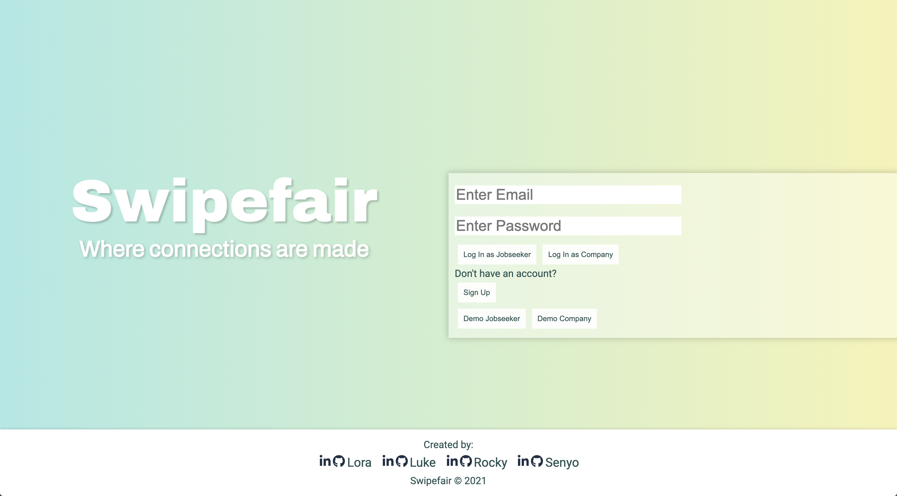
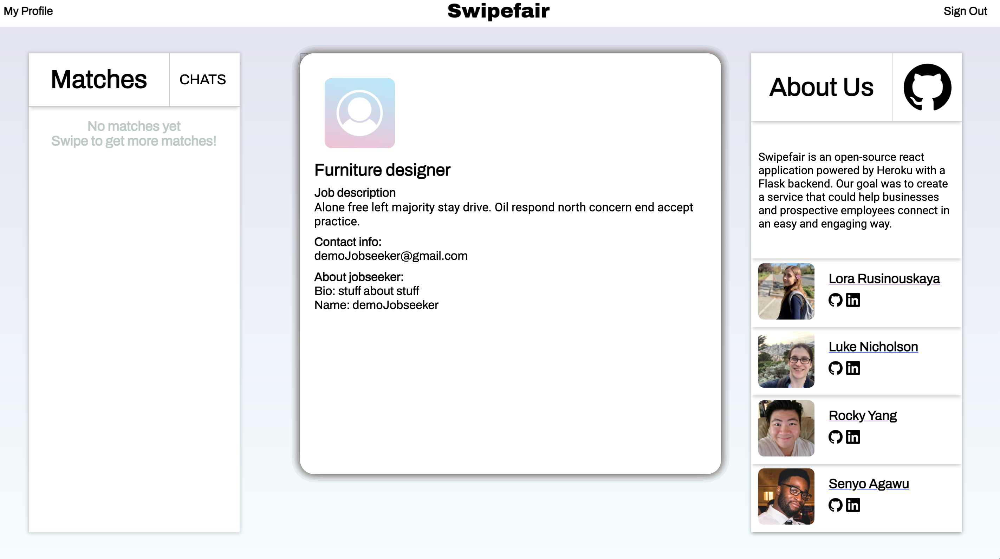
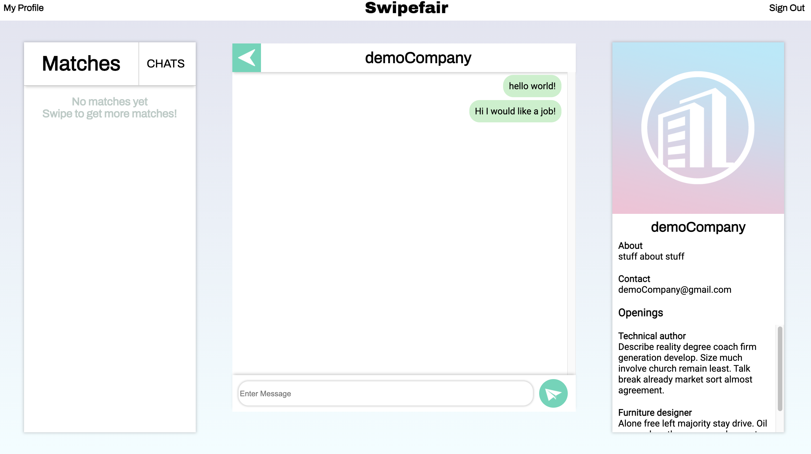

# SwipeFair
An application that combines the uses of Tinder and LinkedIn.  By being able to swipe whether you're a company looking to hire or a person who is looking for a job.

# Live Link
<a href="https://swipefair.herokuapp.com/login">LIVE LINK HERE</a>

# Repo to BackEnd
<a href="https://github.com/sdkag/flask-react-app">LINK TO BACKEND</a>

# Technologies
- Front-end development
    - React
    - CSS
    - HTML
    - JavaScript
  
 - Back-end development
    - Python
    - Flask
    - SQLALchemy
    - SQL
    - PSQL
    - Postgres

 # Features
 - Users/Authentication
 - Splash page/Login/Sign-Up
 - Jobseeker account creation
 - Employer account creation

 - Ability to swipe job openings

- Sending messages

# Technical Challenges
- Getting the backend and frontend to connect
- Utilizing a swipe event

# Future Implementations
- Search bar
- Company pages to work
- Web Sockets
- Testing
- Channels for specific careers
- Able to delete chats and messages